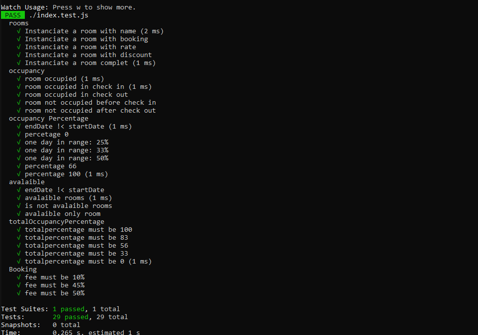

# Testing-Jest

## Description

Definition of classes for testing:

### Room

Properties:

- Name: string
- Bookings: array of Booking objects
- Rate: int price in cents
- Discount: int percentage

Methods:

- isOccupied(date) returns false if not occupied, returns true if occupied

- occupancyPercentage(startDate, endDate) returns the percentage of days with occupancy within the range of dates provided (inclusive)

Static methods:

- totalOccupancyPercentage(rooms, startDate, endDate) returns the total occupancy percentage across all rooms in the array
- availableRooms(rooms, startDate, endDate) returns an array of all rooms in the array that are not occupied for the entire duration

### Booking

Properties:

- Name - string
- Email - string
- Check in - date
- Check out - date
- Discount - int percentage
- Room - a room object

Methods:

- get fee() returns the fee, including discounts on room and booking

## Test running

`$ npm run test`

## Technologies

